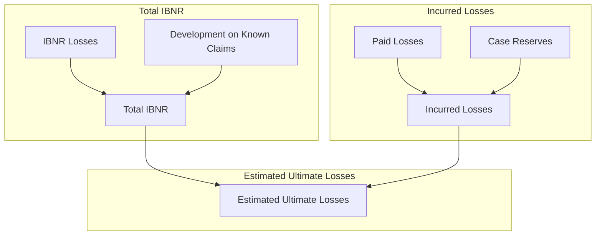

# Loss Reserving Map Diagram

> [!SOURCE] Sources
> - *[[Loss Map Graphic.pdf]]*



![[Loss Map Graphic.pdf]]


***

## Appendix: Links and References

*Note created on [[2023-10-05]] and last modified on [[2023-10-05]].*

### Internal Linked Notes

### External References

#### Backlinks

```dataview
list from [[Untitled]] AND -"CHANGELOG" AND -"//Untitled"
```


***

Jimmy Briggs <jimmy.briggs@jimbrig.com> | 2023

