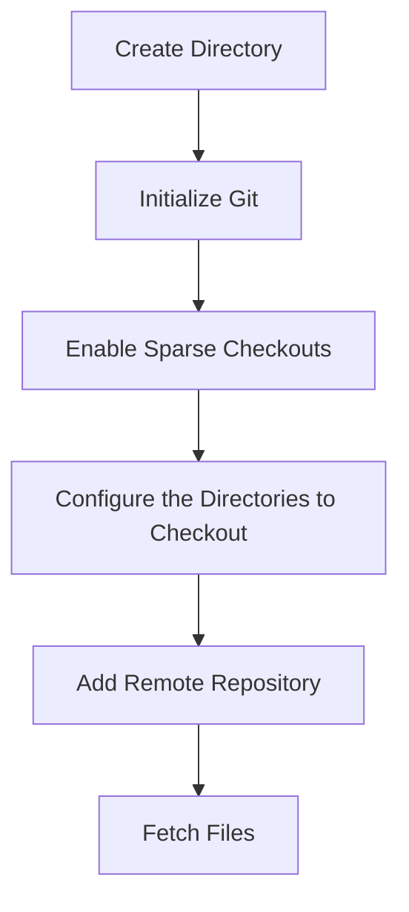

# Using Git Sparse Checkout Guide

> [!SOURCE] Sources
> - *[Using Git Sparse Checkout | Brian Coyner](https://briancoyner.github.io/articles/2013-06-05-git-sparse-checkout/#:~:text=Using%20Git%20Sparse%20Checkout%201%20Step%201%3A%20Create,add%20-f%20origin%20https%3A%2F%2Fgithub.%20com%20%2Fgit%2Fgit.%20git%20)*

## Contents

[TOC]

## Overview

> [!INFO] See Also
> See the more technical reference documentation note: [[Git - Sparse Checkout]] for details and reference documentation on the `git sparse-checkout` command, in depth. 

There are times when all I want or need from a Git repo are a handful files. For example, I use the awesome `git-completion` and `git-prompt` scripts included in the Git project. Thus, I don't need the entire Git repo taking up space.

This is exactly what [sparse checkouts](https://schacon.github.io/git/git-read-tree.html) enable.

## Workflow Steps

Here are the steps to create a *sparse*, local [[Git]] repository that only includes the portions of the remote hosted repositories content:



1. Create local directory
2. Initialize Git Repository
3. Enable Sparse Checkouts
4. Configure Git Sparse Checkout (i.e. tell Git which directories to checkout)
5. Add the Remote
6. Fetch the Files

### Create Local Repository

```bash
mkdir mysparserepo && cd mysparserepo
```

- Creates and enters directory named `mysparserepo`.

### Initialize Git

```bash
git init
```

- Initializes [[Git]] for the newly created `mysparserepo` folder.

### Enable Sparse Checkouts

```bash
git config core.sparsecheckout true
```

- Sets the `core.sparsecheckout` configuration for the local repository's [[Git]] setup to enable sparse checkouts.

### Configure Git Sparse Checkout

```bash
echo <path/to/sub-folder/in/repo/> >> .git/info/sparse-checkout 
```

- Modifies the `info/sparse-checkout` [[Git]] Configuration pointing it to the desired remote repository's relative path.

> [!NOTE] Note
> You can also simply edit the `.git/info/sparse-checkout` file directly.

### Add Remote Repository

```bash
# for https
git remote add -f origin https://github.com/<GitHubUser>/<GitHubRepoName>.git

# for ssh
git remote add -f origin ssh://<GitHubUser>@github.com/<GitHubUser>/<GitHubRepoName>
```

> [!NOTE] Note the difference between using [[HTTPS]] vs. [[SSH]] [[URL]] protocols with [[Git]]. You may need to adjust your `~/.ssh/config` file for using [[SSH]] protocol.

### Fetch Files

```bash
git pull origin remote
```

- Pulls the specified sub-directory from the remote hosted repository to the local repository. 

## Putting it All Together

As an example, let's assume you want to checkout only the [`contrib/compltion`](https://github.com/git/git/tree/master/contrib/completion) folder from the Git repository: <https://github.com/git/git/>.

```bash
LOCAL_DIR_NAME="git-completions"
REMOTE_REPO="https://github.com/git/git.git"
REMOTE_SUBDIR="contrib/completion/"

mkdir $LOCAL_DIR_NAME && cd $LOCAL_DIR_NAME 
git init && git config core.sparsecheckout true
echo $REMOTE_SUBDIR >> .git/info/sparse-checkout
git remote add -f origin $REMOTE_REPO
git pull origin main
```

You should now have the `contrib/completion` directory. No other Git source files exist in your local copy.

***

## Appendix: Links and References

*Note created on [[2023-09-09]] and last modified on [[2023-09-09]].*

### Internal Linked Notes

### External References

- [[Git - Sparse Checkout|git-sparse-checkout]]

#### Backlinks

```dataview
list from [[Using Git Sparse Checkout Guide]] AND -"CHANGELOG" AND -"//Using Git Sparse Checkout Guide"
```


***

Jimmy Briggs <jimmy.briggs@jimbrig.com> | 2023

