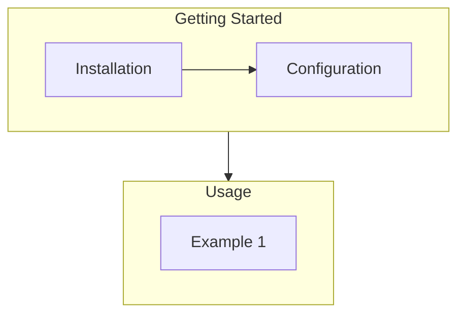

# Software Release Checklist

> [!SOURCE] Sources:
> - [App release checklist (github.com)](https://github.com/oisin/app-release-checklist/blob/master/checklist.md)
> 

## Contents

- [Overview](#overview)
- [Resources](#resources)
	- [Document Template](#document-template)
	- [Git Release Issue Template](#git-release-issue-template)
	- [Release Notes and Changelog Automation](#release-notes-and-changelog-automation)
	- [Build Pipelines and CI/CD](#build-pipelines-and-cicd)
	- [Tips and Tricks](#tips-and-tricks)
- [Steps](#steps)
- [Appendix: Links and References](#appendix-links-and-references)
	- [Internal Linked Notes](#internal-linked-notes)
	- [External References](#external-references)
		- [Backlinks](#backlinks)


## Overview

In [[MOCs/MOC - Software|Software Engineering]] and [[MOC - Development|Development]], a common practice is *releasing new versions* of your developed application or software project over time to end-users. 

This templated [[Lists/Checklists/_README|Checklist]] attempts to breakdown the necessary steps to perform a successful release from the initial *pre-release* and *drafting* steps to the final artifact builds.

***

*Example Flow Chart*



## Resources 

### Document Template

### Git Release Issue Template

### Release Notes and Changelog Automation

### Build Pipelines and CI/CD

### Tips and Tricks


## Steps


***

## Appendix: Links and References

*Note created on [[2023-06-27]] and last modified on [[2023-06-27]].*

### Internal Linked Notes

### External References

#### Backlinks

```dataview
list from [[Checklist - Software Release]] AND -"CHANGELOG" AND -"Lists/Checklists/Checklist - Software Release"
```


***

Jimmy Briggs <jimmy.briggs@jimbrig.com> | 2023