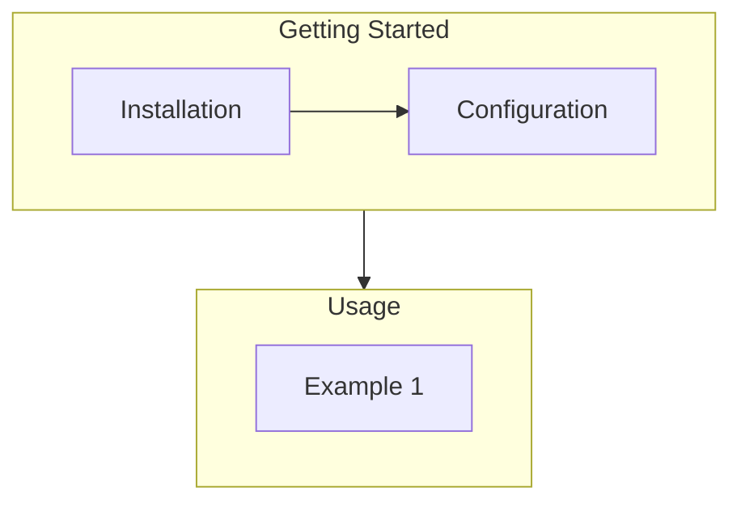

# <% (tp.file.title).replace("Checklist - ", "") + ' Checklist' %>

> [!SOURCE] Sources:
> - 

## Overview

<!-- [TOC] -->

*Example Flow Chart*




## Steps


***

## Appendix: Links and References

*Note created on [[<% tp.file.creation_date("YYYY-MM-DD") %>]] and last modified on [[<% tp.file.last_modified_date("YYYY-MM-DD") %>]].*

### Internal Linked Notes

### External References

#### Backlinks

```dataview
list from [[<% tp.file.title %>]] AND -"CHANGELOG" AND -"<% tp.file.folder(true) %>/<% tp.file.title %>"
```


***

Jimmy Briggs <jimmy.briggs@jimbrig.com> | <% tp.date.now("YYYY") %>